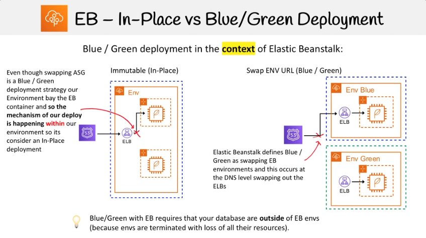

# Elastic Beanstalk

## General Information

- Quickly deploy and manage web-apps on AWS
- It's a PaaS (Platform as a service)
- AWS says it's not recommended for "production" applications
	- For enterprise or very large companies
- Elastic Beanstalk is powered by a CloudFormation template which can setup for you
	- Elastic Load Balancer
	- Autoscaling Groups
	- RDS Database
	- EC2 Instance
	- Monitoring (Cloudwatch, SNS)
	- In-Place and Blue/Green deployment methodologies
	- Security (Rotates passwords)
	- Can run Dockerized environments

---

## Web Vs Worker Environment
- **Web** application uses the Web Environment and there are two types of Web Environment
	- **Load Balanced Env**
		- Uses ASG and set to scale
		- Uses an ELB
		- Designed to scale
	- **Single Instance Environment**
		- Still uses an ASG but Desired Capacity is set to 1, to ensure the server is always running
		- No ELB to save cost
		- Public IP address has to be used to route traffic to server

- **Worker** application uses the Worker Environment
	- It creates the following:
		- ASG
		- SQS queue
		- Installs Sqsd daemon on the EC2 instances
		- Creates CloudWatch Alarm to dynamically scale instances based on health

---

## Deployment Policies

| Deployment Policy  | Load Balanced Env   | Single Instance Env   |
|---|---|---|
| All at once  | V   | V   |
| Rolling   | V  | X  |
| Rolling with additional batch  | V  | X |
| Immutable  | V  | V  |

- **Rolling and Rolling with additional batch requires** an ELB because it attaches and detaches instances in batches from the ELB

### EB - All At Once
1) Deploys the new app version to all instances at the same time
2) Takes all instances **out of service** while the deployment processes
3) Servers become available again
4) The fastest but also the most dangerous deployment method

### Rolling
1) Deployes the new app version to a batch of instances at a time.
2) Take batch's instances **out of service** while the deployment processes.
3) Reattachs updated instances
4) Goes onto next batch, taking them out of service
5) Reattaches those instances (rinse and repeat)

### Rolling With Additional Batch
1) Launch new instances that will be used to replace a batch
2) Deploy update app version to new batch
3) Attach the new batch and terminate the existing batch
4) Rolling with Additional Batch's ensure our capacity is never reduced. This is important for applications where a reduction in capacity could cause availability issues for users.

### Immutable
1) It creates a new ASG group with EC2 instances
2) It then delpoyes the updated version of the app on the new EC2 instances
3) It then point the ELB to the new ASG and deletes the old ASG which will terminate the old EC2 instances.

- **The safest way to deploy for critical applications**
- **In case of failure**, you just terminate the new instances since the existing instances still remain

### Blue/ Green Deployment
- In-Place and Blue/Green Deployment **are not definitive in definition** and the **_context_** can change th6e scope of what they mean 
| | | |
|---|---|---|
|In-Place could mean within the scope of Elastic Beanstalk Env | All the deployment policies provided by EB could be considered In-Place since they are within the scope of a singel EB environment | 1) All at once 2) Rolling 3) Rolling with additional batch 4) Immutable ||
| In-Place could mean within the scope of the same server (not replacing the server) | Deployment policies which do not invovle the server being replaced | 1) All at once 2) Rolling |
| In-Place could mean within the scope of an uninterrupted server | Traffic is never routed away from the server (taken-of-service). Implements Zero-downtime, deploys where Blue/Green occurs on the server | EB can't do this. Capistrano + Ruby on Rails + Unicorn is famous case of this method of deployment |

## EB Configuration Files
- **.ebextensions** is a hidden **folder** called at the root of your project which contains the config files.
-  .config is the extension for the config files which need to be stored in .ebextensions

- Configuration files can config:
	- Option settings
	- Linux / Windows server configuration
	- Custom resources

## Environment Manifest
- The Environment manifest is a file called **env.yml** which is stored at the root of your project.

## EB Linux Server Configuration
- **Packages** - Download and install prepackaged applications and components
- **Users** - Create Linux users
- **Commands** - Execute commands on the EC2 instance before app is setup
- **Container Commands** - Execute commands that affect your application source code
- **Groups** - Create Linux groups and to assign group IDs
- **Services** - Defince which services should be started or stopped when the instance is launched

## EB CLI

| The CLI is hostend on GitHub | [AWS GitHub CLI](https://github.com/aws/aws-elastic-beanstalk-cli) |
|---|---|
| eb init | configure your project directory and the EB CLI |
| eb create | create your first env |
| eb status | see the current status of your env |
| eb health | view health info about the instances and the state of your overall env (use --refresh to update every 10s)|
| eb events | see a list of events output by EB |
| eb logs | pull logs from an instance in your env |
| eb open | open your env's website in a browser |
| eb deploy | once the env is running, deploy an update |
| eb config | take a look at the configuration options available for your running env |
| eb terminante | delete the environment |

## EB Custom Image
- When you create an EB environment, you can specify an AMI to use instead of the standard EB AMI.
- A custom AMI can **improve provisioning times** when intances are launched in your environment if you need to install a lot of software that isn't included in the standard AMIs

## EB - Configuring RDS

- A database can be added **inside** or **outside** your EB environment

### Inside EB Env
- Intended for general development envs
- You create the databse within EB
- When the EB Env is terminated the database will also be terminated

### Outside EB Env
- Intended for **production** envs
- You create the database from RDS separate from EB
- When the EB Env is terminated the database will remain

## Cloud9 CLI Commands
- npm i c9 -g
- npm init -y
- npm i express --save

## CLI Security Group
- curl -s http://169.254.169.254/latest/
- curl -s http://169.254.169.254/latest/meta-data/mac
- curl -s http://169.254.169.254/latest/meta-data/network/interfaces/macs/<your_mac>/security-group-ids
- aws ec2 authorize-security-group-ingress --group-id sg-092c52683ad678316 --port 8080 --protocol tcp --cidr 157.157.86.244/32
- aws ec2 describe-security-groups --group-ids sg-092c52683ad678316 --output text --filters Name=ip-permission.to-port,Values=8080
- curl -s http://169.254.169.254/latest/meta-data/public-ipv4
- 